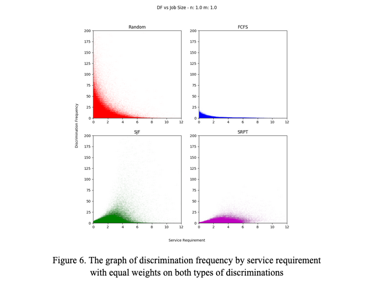

# Fairness in Single Resource Environment

This repository is the simulation component of the literature review project for fairness in single resource environments. This project is part of the Analytical Performance Modeling seminar class taught by Professor Kristen Gardner at Amherst College in fall, 2020.

## Simulation

We investigated one particular gap in the study of [discrimination frequency](http://citeseerx.ist.psu.edu/viewdoc/download?doi=10.1.1.174.5295&rep=rep1&type=pdf) or DF. We found that the paper limited its analysis of the scheduling policy to scenarios. We were curious about the performance of DF under steady state systems, so we created a simulation to examine DF further. Our simulation involved recording the performance of DF under four different policies: Random, SRPT, FCFS, and SJF. We observed that the policies behaved as predicted -- confirming DF’s potential to be used as a system fairness measure. Furthermore, we extended the definition of DF to reflect that proportional and temporal discriminations are not equally unfair. 

